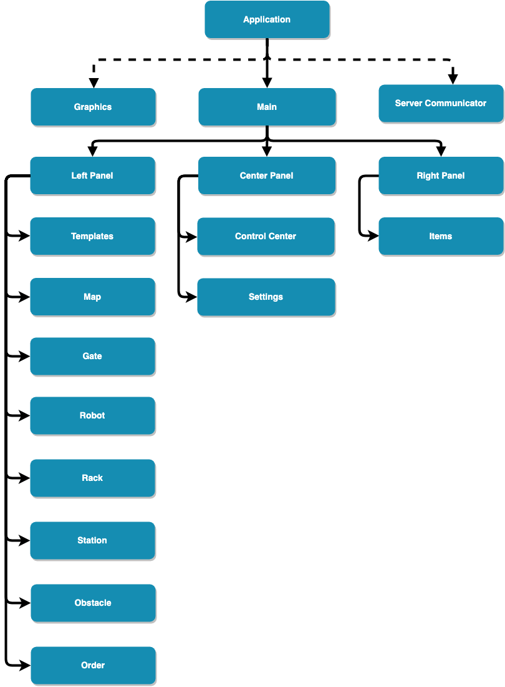

# Hive Frontend
This is the frontend system of the Hive warehouse automation system. 
It's a cross platform system that is built using **ElectronJS**.

Through this GUI the user can perform three main things:
    
- Design their warehouse to mimic their real life warehouse.
- Simulate the warehouse automation system operations.
- Deploy and start operating on real life warehouse.

### System Architecture 
The system architecture is heavily based on **KnockoutJS** which applies the MVVM
design pattern. In this diagram, you will see the overall architecture.

Another key library that we use is **PixiJS**, which provides the outstanding simulation graphics 
and animations.

### Modes
- Design: this mode allows the user to freely design the warehouse by:
    - Selecting warehouse size.
    - Adding new different items with their properties to the warehouse.
    - Adding objects (Gate, Robot, Rack, Charging Station, Obstacle) to the map.
    - Fill ingRacks with items as well as adjust properties for all objects.
    - Saving/Loading the warehouse state.
    - Applying any of the possible templates.

- Simulation: this mode allows user to start experimenting by:
    - Placing orders of different items for the system to fulfill.
    - Seeing logs and statistics that allow you to determine the system status and the overall deign efficiency.
     
- Deployment: this mode interacts directly with the real life robots:
    - You have to provide the server info in the settings panel, and connect to the server.
    - You have to provide IP address for the robots.
    - Here the same simulation starts too but it will be in sync with the real robots.
    
The real life robots prototype we've developed can be found here: [Hive hardware](https://github.com/i-radwan/Hive_hardware/).

### How to use
- `npm install`
- `npm start`

